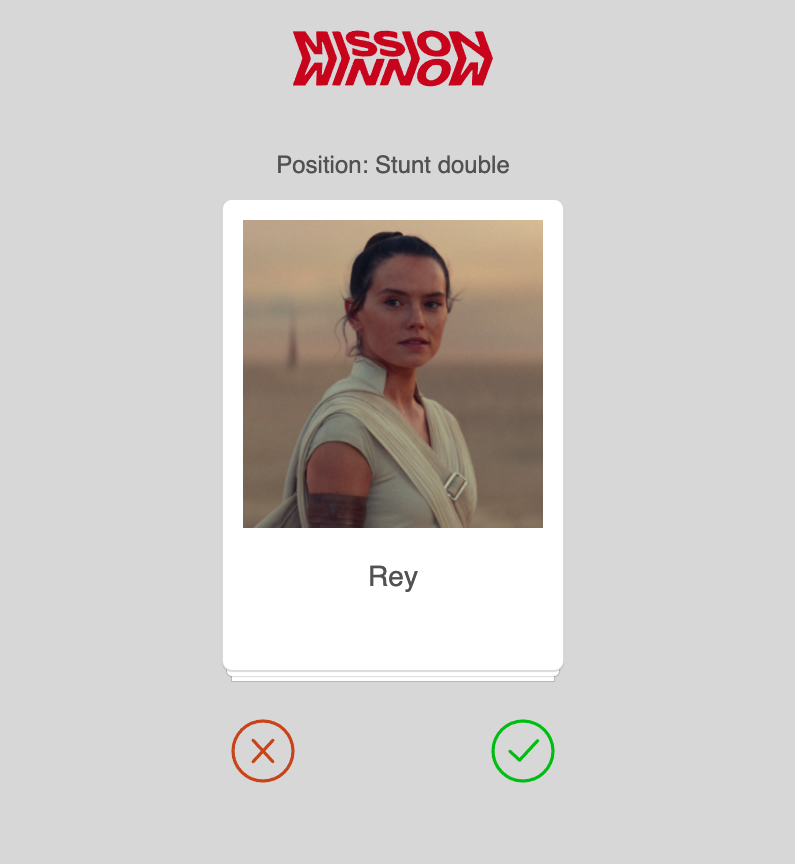

# Find Stunt Doubles

## Demo
View the project [demo](https://alisonyoon.github.io/find-stuntdouble/).

## Run locally
Clone this repo in your machine.
Run `npm start` to view this app locally.

## About

### Achieved
* Creating a data store with an array of 'workers' to be displayed in the UI
* Displaying the stacked cards on the screen
* Implement a mechanism for dragging and dropping an item
* Animating or clearing the card from the screen on release of a drag

### Remaining
* Updating the data layer with the user's choice
* Improve the user feedback and animations

### Main Components
* `src/Workers.js` The data store with an array of stunt doubles.
* `src/FindStuntDouble.js` The Wrapper for the app. It contains the logo, Card Deck, and the user guide icons at the bottom.
* `src/Components/Card.js` Card component with an image of the stunt actor and the name text.
* `src/Components/Deck.js` Make the Cards into Stack. Drag & Drop interaction happens here.

#### Used
I used npm library [react-draggable](https://www.npmjs.com/package/react-draggable#draggablecore-api)
for the draggable card component.

I used [node-sass](https://www.npmjs.com/package/node-sass) for SCSS file.

#### Want to Try
I found some great libraries for animations.
* [React-Spring](https://www.react-spring.io/)
* [React-Use-Gesture](https://use-gesture.netlify.app/)